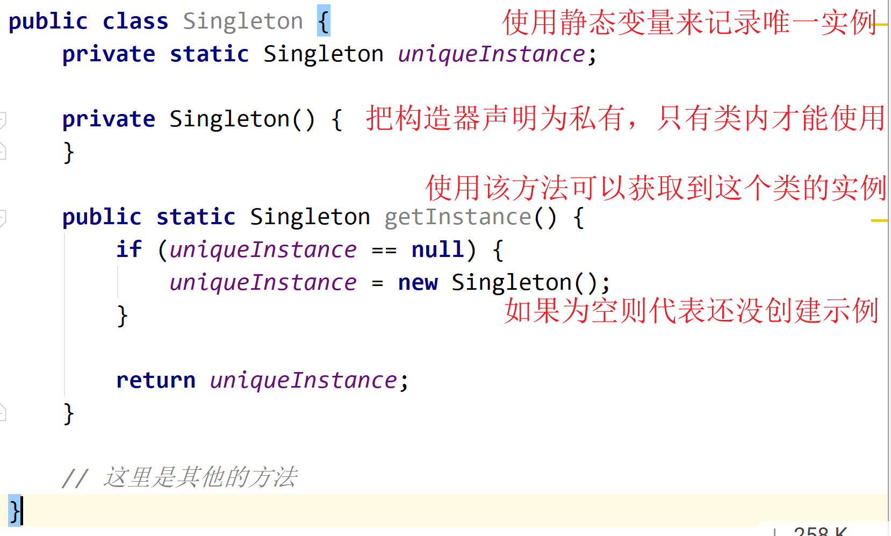
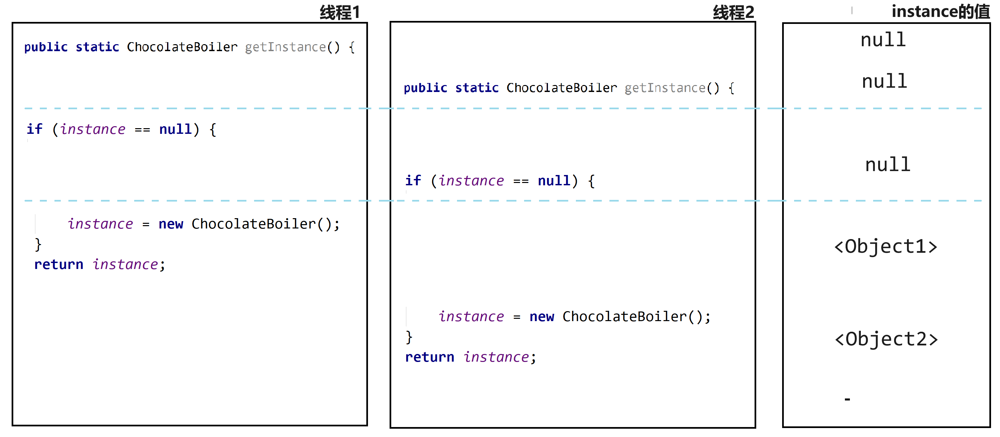

# 第五章单例模式

## 5.1 引言问答

+ 问：单例有什么用处
+ 答：**有一些对象其实我们只需要一个**，比如线程池、缓存、对话框等，如果制造出多个实例，就会导致许多问题产生，例如程序的行为异常、资源使用过量等问题

---

+ 问：为什么不用 Java 的全局静态变量来实现？

+ 答：如果用将对象赋值给一个全局变量，则在程序开始之前就要创建好对象。

  如果创建这个对象非常消耗资源，而这次执行过程中又没有用到，这就会造成浪费

----

+ 问：还有其他缺点吗？
+ 答：如果使用全局变量的话，如果要保证一个对象只能被实例化一次是比较困难的

## 5.2 深入问答

+ 问：如何创建一个对象？
+ 答：使用 new 来创建—— `new MyObject()` 

----

+ 问：其他对象能可以再创建一个 MyObject 对象吗？
+ 答：当然可以

---

+ 问：如果有一个类，我们是否可以实例化它多次？
+ 答：当前可以

---

+ 问：下面代码这样写，会报错吗？

```java
public MyClass {
  private MyClass() {}
}
```

+ 答：不会

---

+ 问：你觉得这段代码合理吗？
+ 答：有点怪，因为这个构造器是私有的。我们想使用构造器就必须在类里面使用；而想在类里面使用，如果是在非静态方法中使用构造器，就需要使用构造器将类实例化。

---

+ 问：下面这个代码变动应该就合理了吧？

```java
public Myclass {
  private MyClass() {}
  
  public static MyClass getInstance() {
    return new MyClass();
  }
}
```

+ 答：合理，私有的构造函数在自己的类里使用，而且也可以通过调用 `getInstance` 方法来获取到这个类的实例化。

---

下面为初步的代码



## 5.3 巧克力工厂例子

现在巧克力工厂有一个锅炉，锅炉的作用是把巧克力和牛奶融化在一起。下面为锅炉控制器的原始代码：

```java
public class ChocolateBoiler {
    private boolean empty;
    private boolean boiled;

    public ChocolateBoiler() {
        // 一开始锅炉是空的，也没有煮沸
        empty = true;
        boiled = false;
    }

    public void fill() {
        // 如果为空开始填入原料
        if (isEmpty()) {
            // 设置好标志
            empty = false;
            boiled = false;

            // 装入巧克力和牛奶的混合物
            // 。。。。。
        }
    }

    public void boil() {
        if (!isEmpty() && !isBoiled()) {
            // 将炉内物煮沸
            // 。。。。。

            // 设置好标志
            boiled =true;
        }
    }


    public void drain() {
        // 如果不为空，且已经煮过了，则将倒出已经制作好的巧克力
        if (!isEmpty() && isBoiled()) {
            // 倒出已经制作好的巧克力
            // 。。。。。
            
            // 设置好标志
            empty = true;
        }
    }

    public boolean isEmpty() {
        return empty;
    }

    public boolean isBoiled() {
        return boiled;
    }
}
```

很明确，这个工厂的锅炉只有一个，需要使用单例模式。如果有多个锅炉实例，会造成不知道锅炉实际的情况，而导致执行了错误的操作。

下面将改为单例模式：

```java
public class ChocolateBoiler {
    private boolean empty;
    private boolean boiled;
  	private static ChocolateBoiler instance;

 		// 将构造器设置成私有
    private ChocolateBoiler() {
        empty = true;
        boiled = false;
    }
  
  	// 返回实例
  	public static ChocolateBoiler getInstance() {
      	if (instance == null) {
          	instance = new ChocolateBoiler();
        }
   			return instance;
    }
  
  	// 下面的代码一致
		// 。。。。。。。
}
```

## 5.4 当单例模式遇到多线程

当单例模式遇到多线程，会导致问题。下面为例子：



上面遇到的问题是两个线程并发判断 `if (instance == null)` ，导致两个线程都进入到了 if 判断里面，从而创建了两个实例。

**解决方案一：**给 `getInstance()` 方法加锁。可以解决但是会导致性能问题。实际只有第一次执行 `getInstance()` 方法才需要加锁，后面执行不需要再加锁。简单来说就是读写锁

```java
// 返回实例
public static synchronized ChocolateBoiler getInstance() {
    if (instance == null) {
        instance = new ChocolateBoiler();
    }
    return instance;
}
```

方案一的优化：

+ 如果加锁 `getInstance()` 并不会导致效率明显下降，就可以不用再改了
+ 在类加载时，直接创建实例。

---

**解决方式二：** 双重检查加锁。利用 **双重检查加锁** ，只有进入到 if 判断语句里才加锁.

下面为代码：进入同步块代码后，还需要再判断实例是否存在。因为防止多个线程进入 if 代码块里后，并发地执行第 10 行，然后创建多个实例。如果在同步块里加上判断，就和不加锁一样的效果了。

```java
public class Singleton {
    private volatile static Singleton instance;

    private Singleton() {}

    public static Singleton getInstance() {
        // 检查实例，如果不存在，则进入同步区块
        if (instance == null) {
            // 对类进行加锁
            synchronized (Singleton.class) {
                // 进入后还需要再判断一次
                if (instance == null) {
                    instance = new Singleton();
                }
            }
        }
        return instance;
    }
}
```

## 5.5 一些单例模式的疑问

+ 问：两个类加载器可能有机会各自创建自己的单例实例
+ 答：是的。每个类加载器都定义了一个命令空间，如果有两个以上的类加载器，不同的类加载器可能会加载同一个类。如果发生在单例上，**就会产生多个单例并存的怪异现象**。其解决方法时，自行指定加载器，并指定同一个类加载器。

---

+ 问：单例模式有没有违反一个类，应该只做一件事的设计
+ 答：有，单例类不只管理自己的实例，也可以在程序中做其他事，承担角色。虽然如此，**但因为类管理自己的实例并不少见，而且这样可以使整体设计更简单**。

---

+ 问：把单例类当时父类，设计出子类，可以这样设计吗？
+ 答：如果要子类继承父类，子类就需要在自己的构造方法调用父类的构造方法。但是构造方法是私有的，子类无法调用父类的构造方法，所以无法创造出子类。

## 5.6 总结

1. 单例模式确保程序中一个类最多一个实例，而且会提供这个实例的访问
2. 单例模式的基本代码是私有的构造方法、一个静态方法和一个静态变量
3. 在性能和资源的基础上，选择适当的方案来实现多线程

5. 如果使用了多个类加载器，会产生多个实例，导致单例失效
6. ~~第五版的 Java 2 ，双重检查加锁会失效~~
7. ~~如果使用了JVM1.2之前的版本，必须建立单例注册表，以免垃圾收集器回收~~
